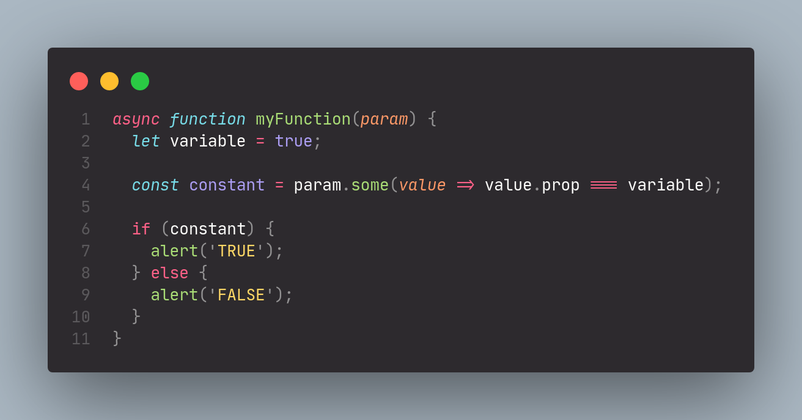
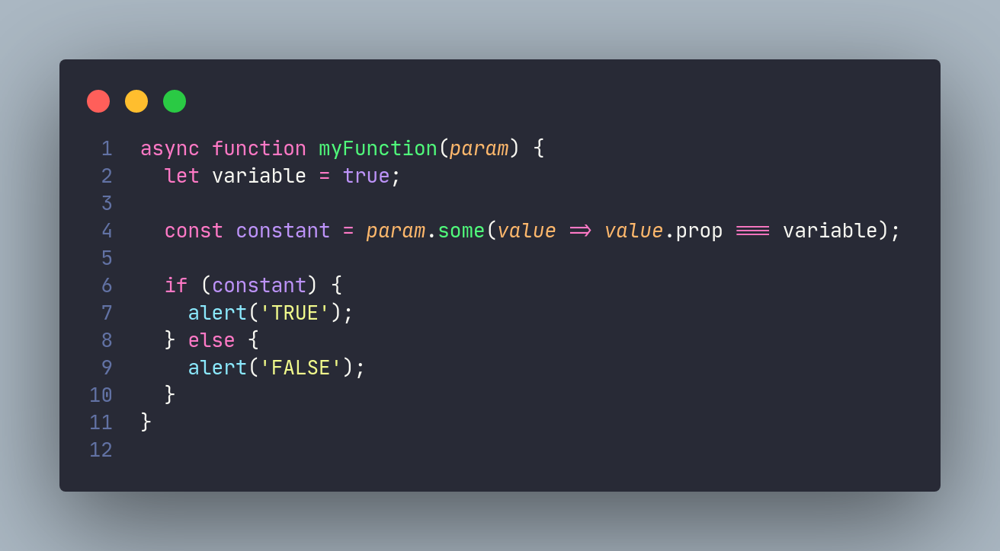
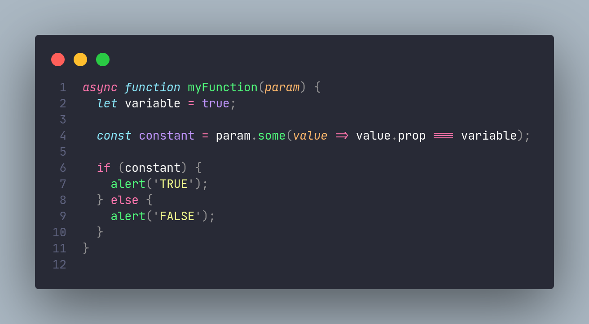

<h1 align="center">
  
   
  <b>MonoDracula</b>
   
  for <a href="http://code.visualstudio.com/">Visual Studio Code</a>
</h1>

  <b>MonoDracula</b> is a dark color theme for Visual Studio Code. It is based on Monokai Pro's syntax highlighting, but with Dracula's color pallete.

 
<code>
  1. Extensions ‣ Search for 'MonoDracula' ‣ Install 
  2. Settings ‣ Color Theme ‣ <b>MonoDracula</b>
</code>
 
 
<h2>Monokai Pro</h2>

 
 
<h2>Dracula</h2>

 
 
<h2>Now, putting them together, we have <b>MonoDracula</b>!</h2>

 
 
 
<h1 align="center">Enjoy!</h1>